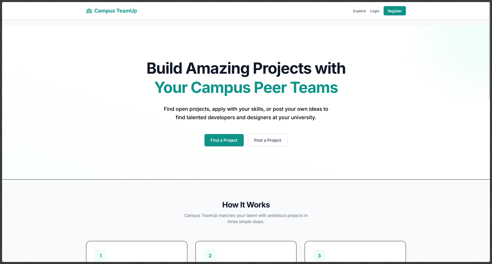
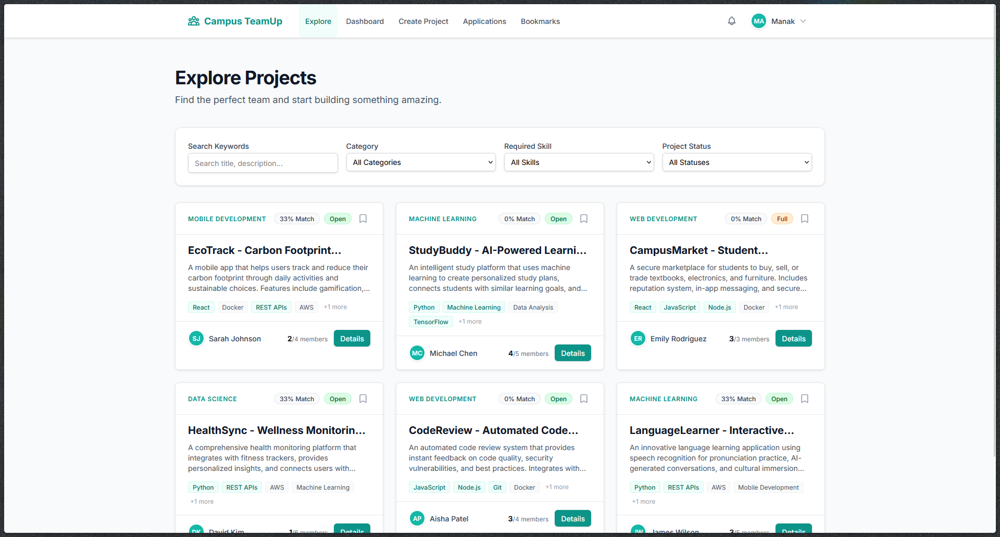
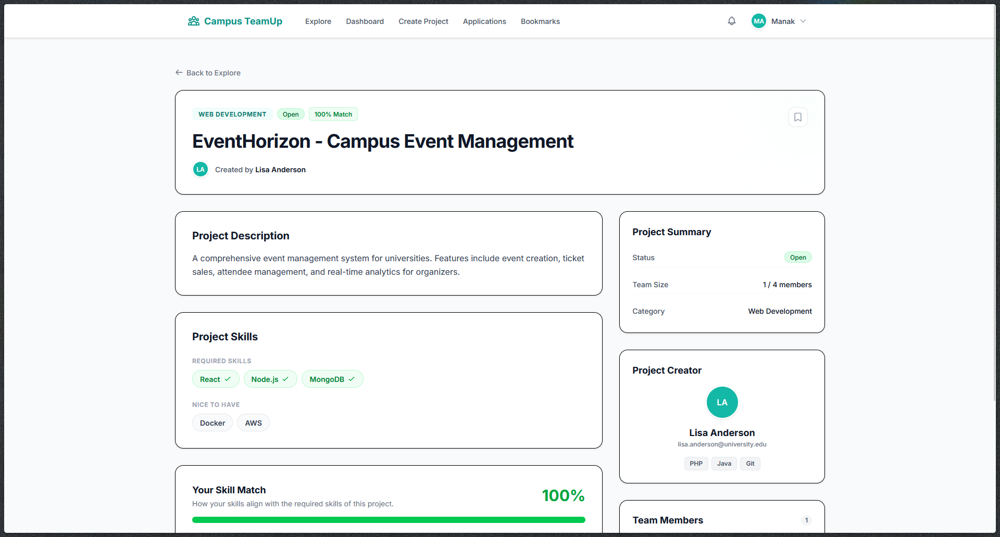
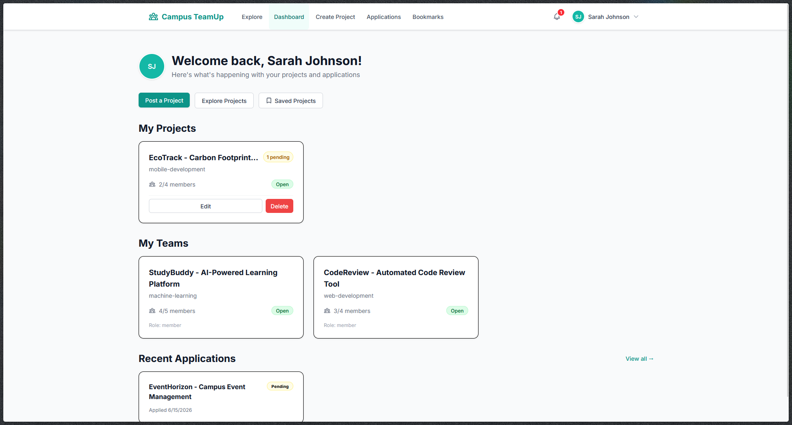
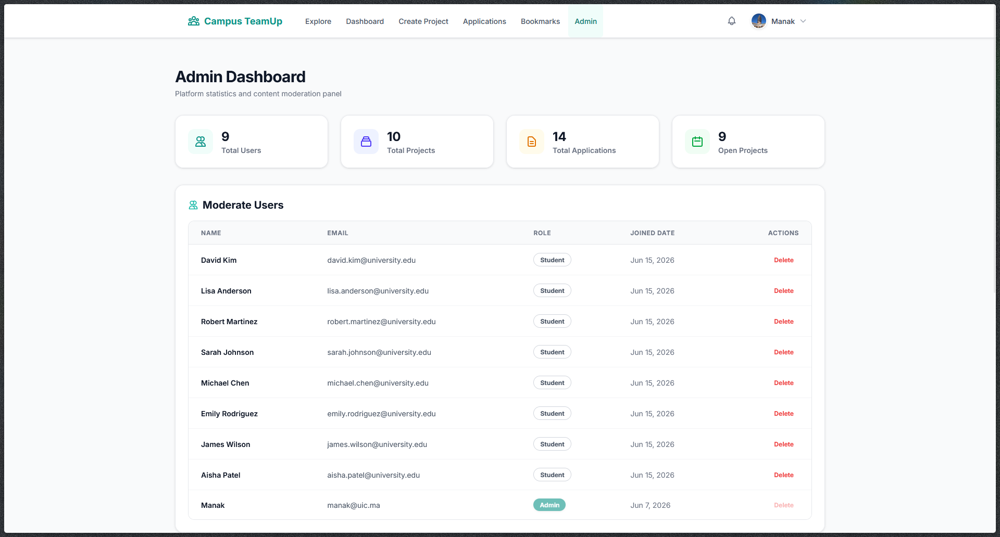
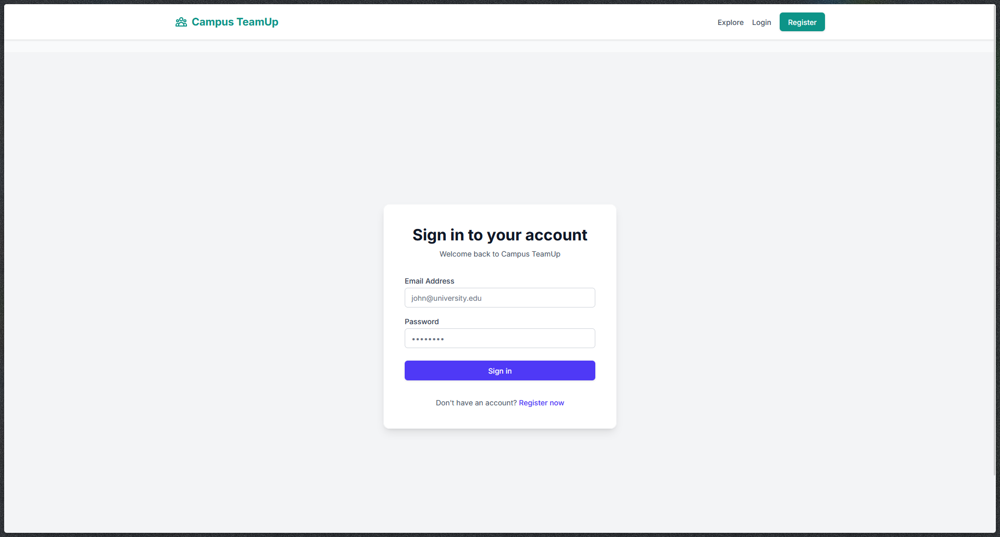

# Campus TeamUp

A platform for university students to publish project ideas, specify required skills, and form teams through structured join requests.

The [Project Specifications Document](docs/specifications.md) for our teacher.

## Team

- [@Manak-hash](https://github.com/Manak-hash)
- [@o-alharrar](https://github.com/o-alharrar)
- [@aymensada](https://github.com/aymensada)

## Tech Stack

### Frontend
- **React 18+** - Modern UI library with hooks and concurrent features
- **TypeScript** - Type-safe JavaScript for better development experience
- **Tailwind CSS** - Utility-first CSS framework for rapid UI development
- **React Router v6** - Client-side routing with protected routes
- **Axios** - HTTP client for API communication
- **Vite** - Fast build tool and dev server

### Backend
- **PHP 8.5+** - Modern PHP with type hints and features
- **Slim 4** - Micro-framework for REST API
- **SQLite 3** - Lightweight relational database
- **PDO** - Database abstraction layer with prepared statements
- **PHPUnit** - Testing framework for backend

### Development Tools
- **Composer** - PHP dependency management
- **npm** - JavaScript package management
- **Git** - Version control

## Project Structure

```
Campus-TeamUp/
├── backend/                    # PHP REST API
│   ├── database/              # SQLite database and schema
│   │   ├── campus-teamup.db  # Database file (generated)
│   │   └── schema.sql        # Database schema
│   ├── public/               # Public web root
│   │   └── index.php         # API entry point
│   ├── src/                  # Application source code
│   │   ├── Controllers/     # API endpoint handlers
│   │   ├── Middleware/       # Authentication & authorization
│   │   └── Models/           # Database models
│   ├── tests/                # PHPUnit test suite
│   ├── vendor/               # Composer dependencies
│   ├── .env.example          # Environment configuration template
│   ├── composer.json         # PHP dependencies
│   └── routes.php            # Route definitions
├── frontend/                  # React TypeScript application
│   ├── public/               # Static assets
│   ├── src/                  # Application source code
│   │   ├── components/       # Reusable UI components
│   │   ├── pages/           # Page components
│   │   ├── services/        # API service layer
│   │   ├── contexts/        # React contexts for state
│   │   └── types/           # TypeScript type definitions
│   ├── .env.example          # Environment configuration template
│   ├── package.json          # npm dependencies
│   └── vite.config.ts       # Vite build configuration
├── docs/                      # Documentation
│   └── specifications.md    # Project requirements
└── README.md                 # This file
```

## Demo

### Platform Overview



The platform homepage where students can discover projects and learn about team formation opportunities.

### Core Features

**🔍 Discover Projects**



Browse and filter projects by category, required skills, and status. Each project card shows skill match percentages based on your profile.

**📋 Project Details**



View comprehensive project information including required skills, team composition, and application status.

**👤 User Dashboard**



Manage your owned projects, team memberships, applications, and saved projects all in one place.

### Admin Panel

**📊 Platform Management**



Administrators can monitor platform statistics, moderate users and projects, and manage platform health.

### Authentication



Secure login system for students to access their accounts and manage their projects.

## Local Development Setup

### Prerequisites

- PHP 8.5+
- Composer
- Node.js 20+
- npm

### Backend Setup

1. Navigate to backend directory:
\`\`\`bash
cd backend
\`\`\`

2. Install dependencies:
\`\`\`bash
composer install
\`\`\`

3. Configure environment:
\`\`\`bash
cp .env.example .env
# Edit .env and set DB_PATH to absolute path
\`\`\`

4. Initialize database:
\`\`\`bash
cd database
sqlite3 campus-teamup.db < schema.sql
cd ..
\`\`\`

5. Start PHP server:
\`\`\`bash
php -S 0.0.0.0:8000 -t public
\`\`\`

Backend will run on http://localhost:8000

**Network Access:** The backend server is configured to accept connections from other devices on your local network. To test from mobile/tablet:
- Find your computer's IP address (e.g., 192.168.1.100)
- Update frontend .env: `VITE_API_URL=http://YOUR_IP:8000`
- Access from other devices: http://YOUR_IP:8000/api/ping

### Frontend Setup

1. Navigate to frontend directory:
\`\`\`bash
cd frontend
\`\`\`

2. Install dependencies:
\`\`\`bash
npm install
\`\`\`

3. Configure environment:
\`\`\`bash
cp .env.example .env
\`\`\`

4. Start Vite dev server:
\`\`\`bash
npm run dev
\`\`\`

Frontend will run on http://localhost:5173

**Network Access:** The dev server is configured to accept connections from other devices on your local network. To test from mobile/tablet:
- Find your computer's IP address (e.g., 192.168.1.100)
- Access from other devices: http://YOUR_IP:5173
- Make sure backend is also accessible from network

## Testing

### Backend Health Check

\`\`\`bash
curl http://localhost:8000/api/ping
\`\`\`

Expected response:
\`\`\`json
{"status":"ok","message":"Campus TeamUp API is running","timestamp":"..."}
\`\`\`

### Frontend

Open browser to http://localhost:5173


## Project Status

- [x] Phase 0: Project Setup 
- [x] Phase 1: Authentication & Profiles
- [x] Phase 2: Projects Core
- [x] Phase 3: Applications & Teams
- [ ] Phase 4: Admin & Polish
- [ ] Phase 5: Ship & Refine


